# Итоговый отчет по исследованию моделирования орбит объектов НОО

## 1. Описание задачи

Цель исследования - построить воспроизводимую систему численного моделирования движения объектов на низкой околоземной орбите (НОО, LEO), пригодную для задачи трекинга космического мусора наземными радиолокационными средствами. Практический сценарий такой: радар получает несколько последовательных измерений объекта, после чего требуется быстро и достаточно точно спрогнозировать траекторию на несколько витков вперед. Такой прогноз нужен для повторного наведения, поиска объекта в следующем окне наблюдения и уточнения его координат.

Для НОО характерное время одного витка составляет примерно 90-105 минут. Поэтому в работе основное внимание уделялось горизонту прогноза до 12 часов, что соответствует нескольким последовательным виткам. В качестве метрик использовались:

- модуль ошибки положения `|dr|`, km;
- модуль ошибки скорости `|dv|`, km/s;
- компоненты ошибки положения в радиальном, along-track и cross-track направлениях, km.

### 1.1. Оценка характерной плотности космического мусора

Для оценки требуемой точности прогноза полезно понимать не только ошибку модели, но и характерную пространственную плотность объектов. В открытых источниках обычно публикуются не точные трехмерные плотности по высотам, а интегральные оценки популяции по размерам и графики распределений. Поэтому ниже приведена оценка порядка величины, а не operational-модель среды типа ORDEM или MASTER.

Использованные источники:

- ESA Space Debris Office, [Space debris by the numbers](https://www.esa.int/Space_Safety/Space_Debris/Space_debris_by_the_numbers);
- NASA Orbital Debris Program Office, [официальный сайт ODPO](https://orbitaldebris.jsc.nasa.gov/);
- S. G. Turyshev, [Orbital Debris in Earth Orbit: Operations, Stability, Control, and Market Formation](https://arxiv.org/abs/2603.23552), 2026;
- S. Azzi, X. Oikonomidou, S. Lemmens, [The space environment particle density in Low Earth Orbit based on two decades of in-situ observation](https://arxiv.org/abs/2409.13794), 2024.

По сводкам ESA, пересказанным и агрегированным в открытой литературе, порядок популяций следующий: около `5.4e4` объектов больше `10 cm`, около `1.2e6` объектов в диапазоне `1-10 cm`, около `1.4e8` объектов в диапазоне `1 mm-1 cm`. Объекты крупнее `10 cm` в основном относятся к отслеживаемой или потенциально отслеживаемой популяции; сантиметровые и миллиметровые объекты в основном не сопровождаются индивидуально, но важны для оценки риска столкновений.

Характерную длину `L` оценивали из объема сферической оболочки:

```text
V = 4*pi/3 * ((R_E + h2)^3 - (R_E + h1)^3)
L = (V / N)^(1/3)
```

Здесь `R_E = 6371 km`, `h1`, `h2` - границы высотной оболочки, `N` - число объектов в этой оболочке. Если грубо распределить всю модельную популяцию равномерно по НОО `160-2000 km`, получаются такие значения:

| Размер объектов | Принятое число объектов | Характерная длина в оболочке 160-2000 km |
| --- | ---: | ---: |
| `>10 cm` | `5.4e4` | `~288 km` |
| `1-10 cm` | `1.2e6` | `~102 km` |
| `1 mm-1 cm` | `1.4e8` | `~21 km` |

Если тот же расчет сделать для более узкой и загруженной области `500-900 km`, получаются меньшие расстояния:

| Размер объектов | Принятое число объектов | Характерная длина в оболочке 500-900 km |
| --- | ---: | ---: |
| `>10 cm` | `5.4e4` | `~167 km` |
| `1-10 cm` | `1.2e6` | `~59 km` |
| `1 mm-1 cm` | `1.4e8` | `~12 km` |

Эти числа нельзя трактовать как реальные межобъектные расстояния в конкретной орбитальной плоскости: объекты распределены неравномерно по высоте, наклонению, долготе узла и фазе. Тем не менее порядок величины показывает, что ошибка прогноза в несколько километров существенно меньше средней трехмерной характерной длины для отслеживаемых объектов `>10 cm`. Для задачи повторного поиска это важно: километровая точность не гарантирует отсутствие ложных ассоциаций, но резко сужает область поиска по сравнению с десятками и сотнями километров.

## 2. Построение модели моделирования

Состояние объекта задается шестимерным вектором в СИ:

```text
y = [r_x, r_y, r_z, v_x, v_y, v_z],
```

где `r` - геоцентрический радиус-вектор, m, `v` - скорость, m/s. Интегрируется система:

```text
dr/dt = v
dv/dt = a_total
```

Набор сил переключается через `ForceModelConfig` в `dynamics/force_models.py`. Это было принципиально для исследования: один и тот же код позволял включать и отключать отдельные возмущения, сравнивая вклад каждой модели.

### 2.1. Гравитация Земли

Базовая гравитационная модель - центральное поле сферической Земли:

```text
a_E = -mu_E * r / |r|^3
```

где `mu_E = 3.986004418e14 m^3/s^2`. Это дает основное кеплерово движение, но не воспроизводит прецессию орбиты и долготные неоднородности поля.

Первое улучшение - аналитическая поправка `J2`, описывающая сплюснутость Земли. В коде есть два режима:

- `j2_frame="gcrs_fixed_axis"` - старый воспроизводимый режим, где ось `z` фиксирована в GCRS;
- `j2_frame="itrs_body_fixed"` - физически более корректный режим: положение переводится в ITRS, ускорение считается в связанной с Землей системе и затем возвращается в GCRS.

Продвинутая модель - статическое поле EGM2008. Коэффициенты читаются из локального ICGEM `.gfc` файла `data/cache/egm2008.gfc`. Ускорение от сферических гармоник считается в body-fixed ITRS и поворачивается обратно в GCRS. В экспериментах использовались степени и порядки `(2,2)`, `(4,4)`, `(8,8)`, `(12,12)`, `(24,24)`. В итоговой лучшей модели использован вариант `(8,8)`.

Важно: `J2` и `EGM2008 (2,2)` - не одно и то же. `J2` - осесимметричная аналитическая поправка с одним коэффициентом. `EGM2008 (2,2)` содержит полный набор гармоник степени 2 и порядка до 2: `C20`, `C21`, `S21`, `C22`, `S22`. Поэтому переход от `J2` к `EGM2008 (2,2)` добавляет долготную неоднородность гравитационного поля Земли.

### 2.2. Атмосферное сопротивление

Сопротивление атмосферы моделируется баллистической формулой:

```text
a_drag = -1/2 * Cd * A / m * rho * |v_rel| * v_rel
v_rel = v - omega_E x r
```

Здесь `Cd` - коэффициент сопротивления, `A` - эффективная площадь, m^2, `m` - масса, kg, `rho` - плотность атмосферы, kg/m^3. Скорость берется относительно атмосферы, вращающейся вместе с Землей.

В проекте реализованы два варианта плотности:

- простая экспоненциальная модель `rho(h) = rho0 * exp(-(h-h0)/H)`;
- NRLMSISE-00, если установлен пакет `nrlmsise00` и доступны входные индексы солнечной и геомагнитной активности.

Экспоненциальная модель проста и воспроизводима, но физически груба для высот НОО. NRLMSISE-00 учитывает широту, долготу, высоту, время, солнечную и геомагнитную активность, поэтому является более реалистичной, но зависит от качества входных индексов.

### 2.3. Третьи тела, излучение, приливы, релятивистская поправка

Притяжение Солнца и Луны реализовано как дифференциальное третье тело в геоцентрической системе:

```text
a_body = mu_b * ((r_b - r) / |r_b - r|^3 - r_b / |r_b|^3)
```

Давление солнечного излучения считается в cannonball-приближении через `Cr*A/m`. Для тени Земли доступны варианты `none`, `cylindrical`, `conical`. Также в коде есть простые модели собственного ИК-излучения Земли, твердотельных приливов и Schwarzschild-релятивистской поправки. В additive study эти силы проверялись отдельно; устойчивого значимого улучшения для рассматриваемых 12-часовых прогнозов они не дали.

### 2.4. Интегратор

В проекте доступны два интегратора:

- `rk4_fixed` - классический RK4 с фиксированным шагом;
- `dop853` - адаптивный интегратор `scipy.integrate.solve_ivp` с методом DOP853.

В ранних экспериментах переход к `dop853` дал заметное отличие от фиксированного RK4. В итоговых оптимизационных ноутбуках использован `dop853` с `rtol = 3e-9` и вектором `atol = [1e-2, 1e-2, 1e-2, 1e-5, 1e-5, 1e-5]` в единицах `[m, m, m, m/s, m/s, m/s]`.

## 3. Используемые данные для отладки алгоритма

Модель проверялась не по TLE, а по precise-orbit reference данным, содержащим координаты и скорости. Это важно: скорость бралась из внешнего POD/SP3/EOF продукта, а не восстанавливалась конечными разностями.

Использованы 6 аппаратов на НОО, для каждого около 24 часов данных:

| Спутник | Формат reference данных | Число samples | Медианная высота, km | Номинальные параметры КА |
| --- | --- | ---: | ---: | --- |
| Sentinel-1A | ESA Sentinel EOF | 7921 | 698.5 | `m=2185 kg`, `A=10.3 m^2`, `Cd=2.2`, `Cr=1.3` |
| Sentinel-1B | ESA Sentinel EOF | 7921 | 699.1 | `m=2185 kg`, `A=10.3 m^2`, `Cd=2.2`, `Cr=1.3` |
| CASSIOPE / Swarm-E | SP3 | 79201 | 858.0 | `m=500 kg`, `A=2.2 m^2`, `Cd=2.2`, `Cr=1.3` |
| Swarm B | ESA Swarm SP3 | 7921 | 512.9 | `m=438 kg`, `A=1.1 m^2`, `Cd=2.2`, `Cr=1.3` |
| Swarm C | ESA Swarm SP3 | 7921 | 479.9 | `m=438 kg`, `A=1.1 m^2`, `Cd=2.2`, `Cr=1.3` |
| Swarm A | ESA Swarm SP3 | 7921 | 479.9 | `m=438 kg`, `A=1.1 m^2`, `Cd=2.2`, `Cr=1.3` |

В `1_orbit_propagation_demo.ipynb` была проведена базовая демонстрация моделирования орбит и ground track. Для отчета интерактивные Plotly-графики были переведены в статические изображения без пересчета оптимизаций.

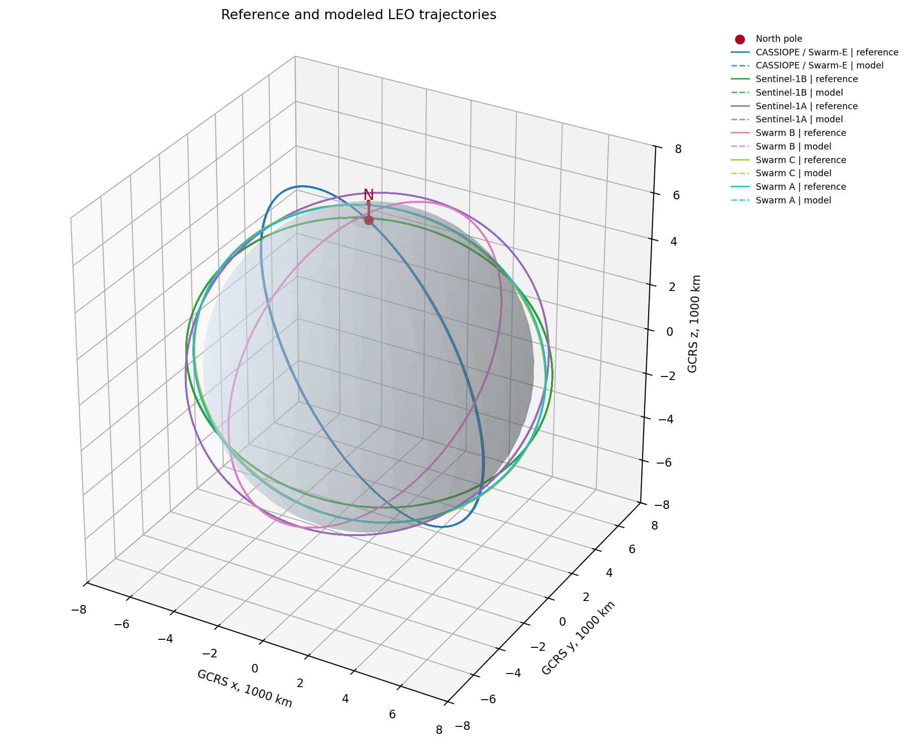

*Рисунок 1. Трехмерные траектории 6 аппаратов в GCRS по данным `1_orbit_propagation_demo.ipynb`. Сплошные линии соответствуют reference/POD траекториям, пунктирные линии - результату прямого моделирования; цвет задает спутник. Голубая сфера - Земля, красная стрелка `N` показывает направление на северный полюс.*

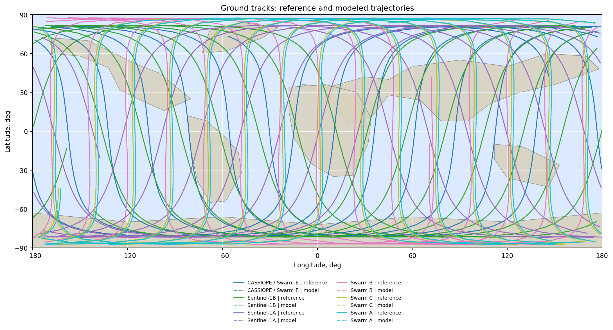

*Рисунок 2. Проекции траекторий на поверхность Земли для тех же данных. Фон показывает океаны и упрощенные контуры материков. Сплошные линии - reference траектории, пунктирные линии - модель; цвет задает спутник.*

В `2_prediction_error_growth_demo.ipynb` исследовался рост ошибки прогноза в простом варианте модели. На графиках ниже показаны характерные ошибки по положению, компонентам residual и скорости, а также агрегирование `|dr|` по 100-минутным окнам.

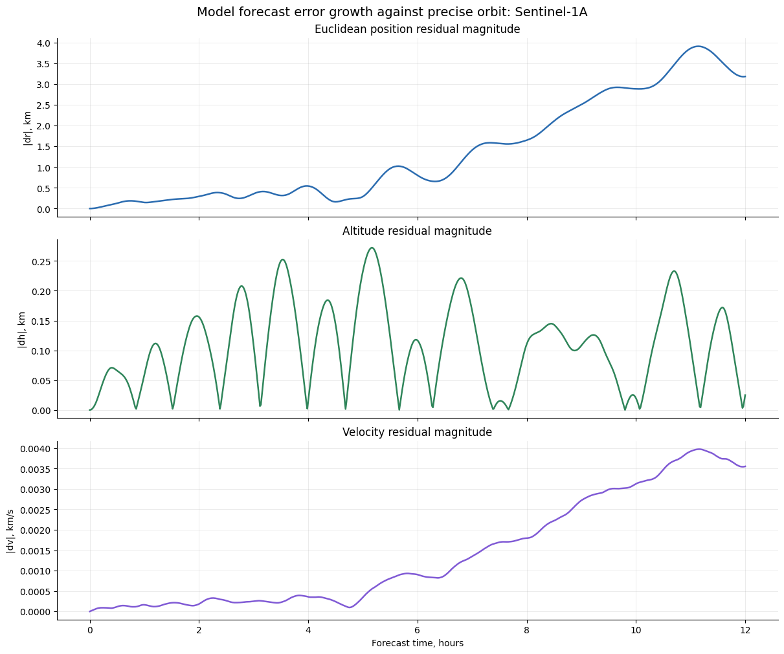

*Рисунок 3. Рост ошибки прогноза для одного спутника из `2_prediction_error_growth_demo.ipynb`: сверху модуль ошибки положения `|dr|`, ниже компоненты ошибки и ошибка скорости. Цвета кривых соответствуют метрикам, указанным в легенде самого рисунка.*

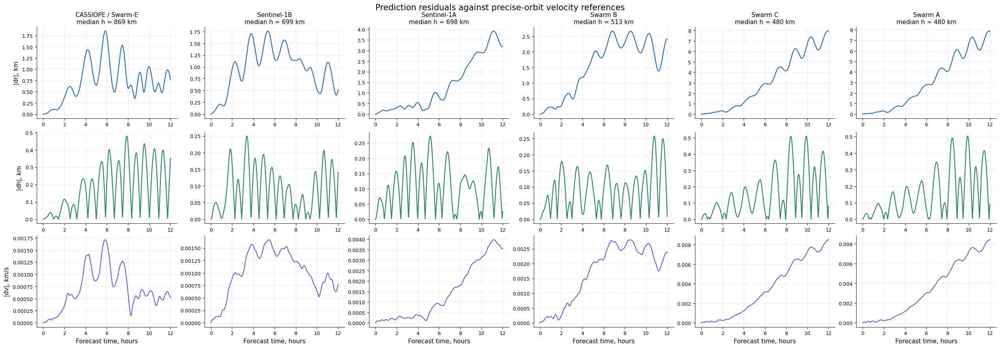

*Рисунок 4. Ошибка прогноза для всех 6 спутников в простом сценарии моделирования. Каждая панель соответствует отдельному спутнику; кривые показывают ошибки положения, высоты и скорости относительно reference orbit.*

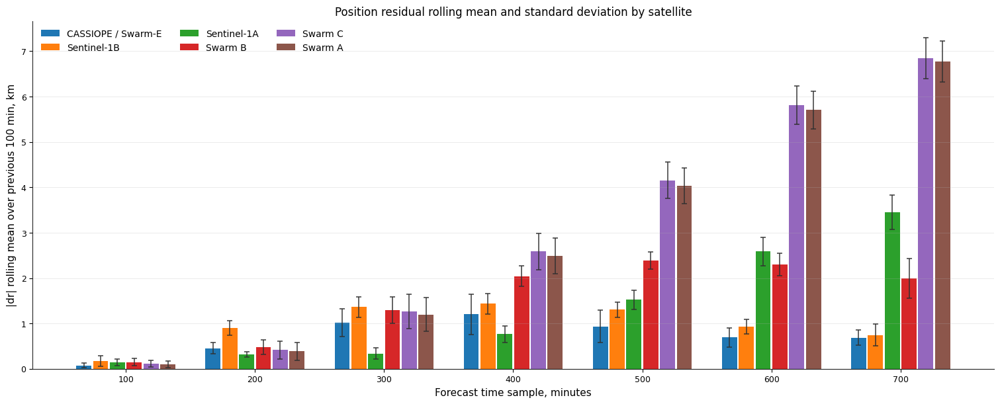

*Рисунок 5. Средняя невязка `|dr|` по 100-минутным окнам прогноза. Цвет столбца соответствует типу спутника; вертикальные error bars показывают стандартное отклонение `|dr|` внутри соответствующего окна.*

## 4. Аддитивное исследование влияния отдельных сил

В `3_residual_addition_study.ipynb` выполнен one-by-one addition experiment: сначала задавалась базовая конфигурация, затем в каждом сценарии менялся только один элемент модели. Это позволяет отделить вклад конкретной физической или численной поправки от остальных факторов.

Базовая модель для сравнения включала:

- центральное поле Земли и аналитическую `J2`-поправку в body-fixed постановке;
- экспоненциальную атмосферу;
- Солнце и Луну как третьи тела;
- солнечное радиационное давление без тени Земли;
- интегратор `dop853`.

Проверенные модификации соответствовали следующему списку:

0. Интегратор: замена адаптивного `dop853` на фиксированный `rk4_fixed`.
1. Гравитационное поле Земли: замена простой `J2`-модели на EGM2008.
2. Атмосфера Земли: замена экспоненциальной атмосферы на NRLMSISE-00.
3. Цилиндрическая тень Земли для солнечного радиационного давления.
4. Коническая тень Земли для солнечного радиационного давления.
5. Собственное ИК-излучение Земли.
6. Твердотельные приливы.
7. Schwarzschild-релятивистская поправка.

Наиболее существенные эффекты в этом эксперименте дали численная схема, гравитационное поле и, для части спутников, модель атмосферы. Тень Земли, ИК-излучение, твердотельные приливы и релятивистская поправка в текущем 12-часовом сценарии меняли residuals существенно слабее и не дали устойчивого улучшения качества прогноза.

На всех рисунках раздела 4 синий цвет соответствует baseline, а красный - варианту, где изменен ровно один элемент модели. Строки показывают `|dr|`, radial, along-track, cross-track и `|dv|`; колонки соответствуют отдельным спутникам.

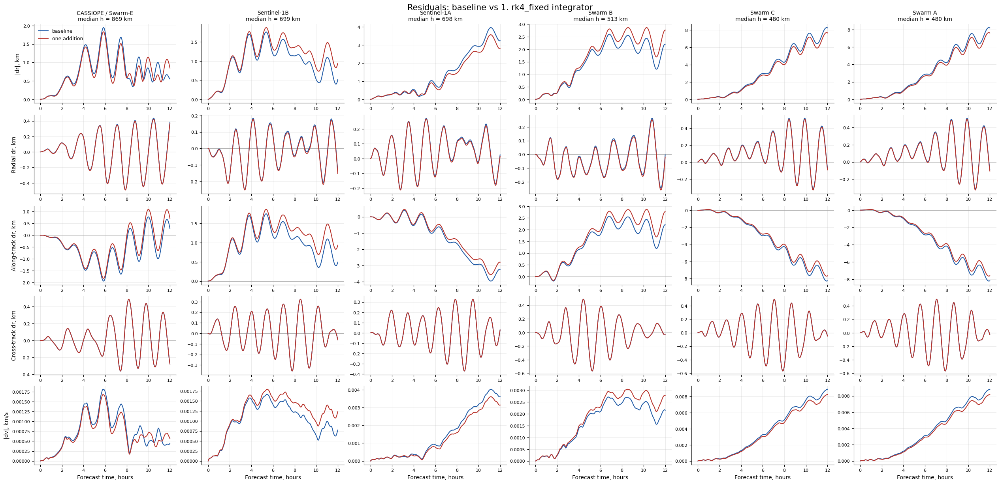

*Рисунок 6. Additive study для интегратора. Baseline использует адаптивный `dop853`; красная кривая показывает прогноз при замене только интегратора на фиксированный `rk4_fixed`. Заметное изменение residuals подтверждает, что численная схема и параметры интегрирования являются частью физически значимой конфигурации модели.*

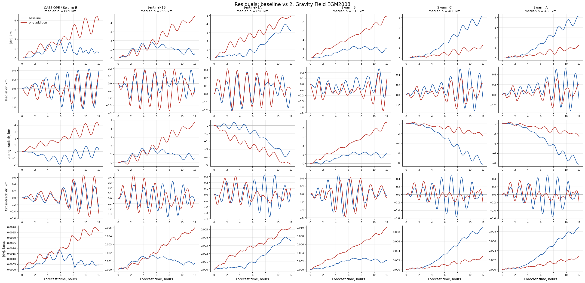

*Рисунок 7. Additive study для гравитационного поля Земли. Baseline использует центральное поле и аналитическую `J2`-поправку; красная кривая показывает вариант с EGM2008 при неизменных остальных силах. Этот переход дает один из наиболее заметных вкладов в прогноз.*

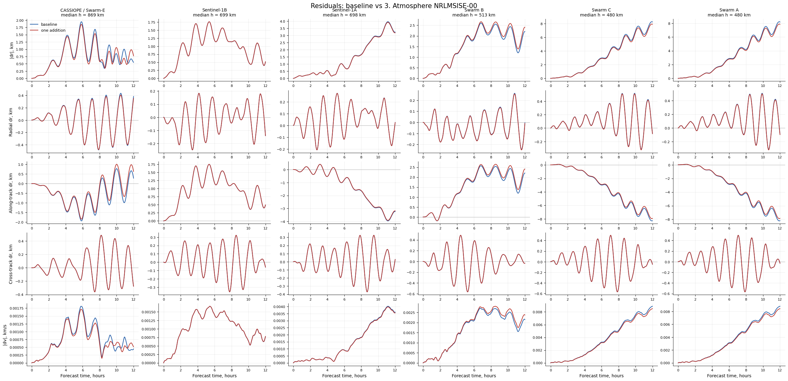

*Рисунок 8. Additive study для атмосферы. Baseline использует экспоненциальную модель плотности; красная кривая показывает вариант с NRLMSISE-00. Эффект зависит от высоты, баллистического коэффициента и конкретного спутника.*


*Рисунок 9. Additive study для цилиндрической тени Земли. Baseline считает SRP без затенения; красная кривая включает простую цилиндрическую модель тени. На рассматриваемом горизонте вклад этой поправки мал по сравнению с гравитацией и интегратором.*

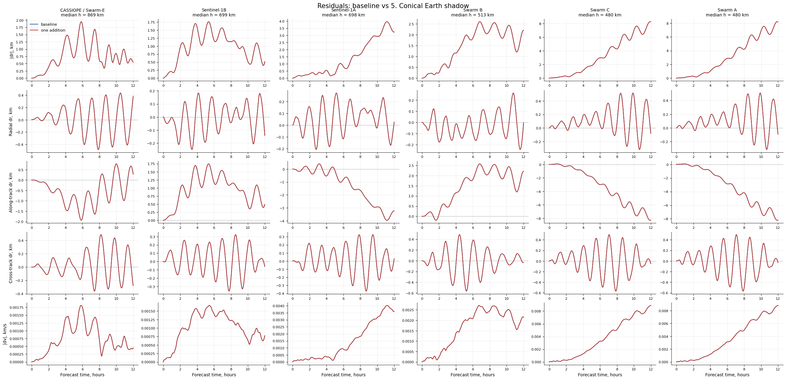

*Рисунок 10. Additive study для конической тени Земли. Baseline считает SRP без затенения; красная кривая включает коническую модель с переходом через полутень. В текущем наборе орбит отличие от baseline остается небольшим.*


*Рисунок 11. Additive study для собственного ИК-излучения Земли. Baseline не учитывает Earth IR; красная кривая включает изотропную модель ИК-давления. Для рассматриваемых спутников вклад этой силы оказался вторичным.*


*Рисунок 12. Additive study для твердотельных приливов. Baseline не учитывает приливную поправку; красная кривая включает degree-2 solid Earth tides. Изменение residuals мало на фоне основных ошибок прогноза.*


*Рисунок 13. Additive study для Schwarzschild-релятивистской поправки. Baseline не учитывает релятивистский член; красная кривая включает его при неизменных остальных силах. На 12-часовом горизонте вклад поправки существенно меньше эффекта EGM2008 и атмосферы.*

## 5. Оптимизация модели прогнозирования

Основная идея ноутбуков серии `4_...` - не просто запустить модель от последнего измерения, а уточнить начальное состояние и эффективные параметры аппарата по нескольким историческим измерениям. Рассматривались варианты `N_MEASUREMENTS = 2` и `N_MEASUREMENTS = 3`.

Постановка оптимизации:

1. Выбираются 2 или 3 последовательные точки измерения, соответствующие одинаковому направлению пересечения заданной широты.
2. Последняя точка считается `t = 0`; прогноз строится от нее вперед на `FORECAST_HOURS = 12 h`.
3. Оптимизируются добавки к начальному состоянию в первой точке tie-in окна.
4. При полной постановке оптимизируются координаты, скорости и эффективные параметры КА.
5. Остатки считаются по последующим измерениям в окне tie-in.
6. Последняя точка измерения получает более жесткий anchor через `LAST_MEASUREMENT_OBSERVATION_SCALE = 0.2`, чтобы прогноз от `t=0` был согласован с самым свежим наблюдением.

Оптимизируемые группы:

- координаты начального состояния, m;
- скорости начального состояния, m/s;
- баллистический коэффициент сопротивления `Cd*A/m`, m^2/kg;
- коэффициент радиационного давления `Cr*A/m`, m^2/kg;
- scale factors для включенных малых сил, например `gravity_harmonics`, `third_body_sun`, `third_body_moon`.

Разные физические величины нормируются перед оптимизацией. Для наблюдений использованы сигмы `50 m` по координатам и `1 m/s` по скоростям. Для параметров используется логарифмическая нормировка с `PARAMETER_LOG_SIGMA = log(1.5)` и bounds множителей `(0.2, 5.0)`. Это делает decision vector численно сопоставимым и не смешивает метры, m/s и безразмерные множители напрямую.

Основной локальный метод - `scipy.optimize.least_squares` с robust loss `soft_l1`. В verbose-таблице:

- `Cost` - robust стоимость; для обычного МНК это `0.5 * sum(residuals**2)`, здесь используется `soft_l1`;
- `Cost reduction` - уменьшение стоимости относительно предыдущей итерации;
- `Step norm` - норма шага в нормированном decision vector;
- `Optimality` - мера близости к стационарной точке с учетом bounds.

### 5.1. Базовый N2 tie-in

В простом варианте N2 (`4_trajectory_tie_in_optimization_N2.ipynb`) оптимизация не всегда улучшала максимум ошибки для всех спутников. Например, для CASSIOPE максимум `|dr|` изменился с `5.172 km` до `6.093 km`, но final `|dr|` улучшился с `3.827 km` до `1.490 km`. Это показало, что сама схема tie-in работоспособна, но качество сильно зависит от физической модели.

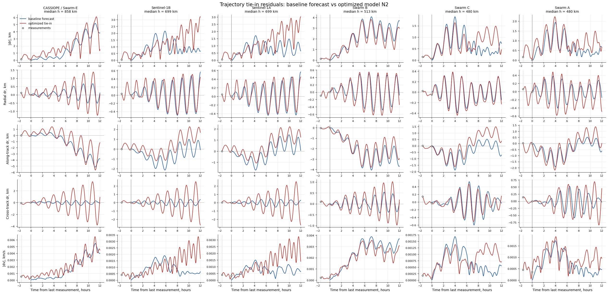

*Рисунок 14. Residual visualization для простого N2 tie-in сценария из `4_trajectory_tie_in_optimization_N2.ipynb`. Синий цвет - baseline forecast от последнего измерения, красный - optimized tie-in, черные маркеры - точки измерений, использованные в оптимизации.*

### 5.2. SGP4 benchmark

В `4_sgp4_vs_tie_in_optimization_N2.ipynb` SGP4 сравнивался с текущей физической моделью на тех же локальных reference данных. Важно: использовался не официальный TLE, а synthetic SGP4, fitted к локальным state vectors. Это честнее для сравнения на одинаковом входе, но такой fitted SGP4 не является operational TLE.

На части спутников fitted SGP4 проигрывал существенно. Например, для Sentinel-1A и Sentinel-1B в сохраненном прогоне `max |dr|` fitted SGP4 превысил `120 km`, тогда как физическая модель оставалась на километровом уровне. Это связано с тем, что SGP4 mean elements плохо восстанавливаются из малого числа точек и чувствительны к согласованию TEME/GCRS и mean/osculating элементов.

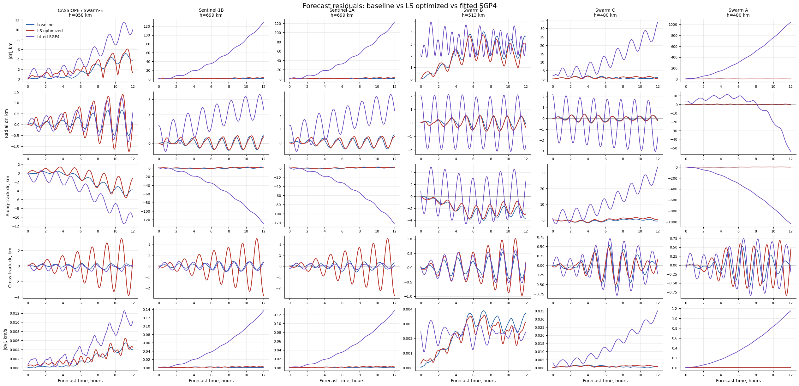

*Рисунок 15. Компактное сравнение baseline физической модели, LS-optimized физической модели и fitted synthetic SGP4 из `4_sgp4_vs_tie_in_optimization_N2.ipynb`. Цвета соответствуют трем моделям в легенде рисунка; сравнение выполнено относительно тех же reference orbit данных.*

### 5.3. Differential evolution vs least squares

В `4_trajectory_tie_in_optimization_N2_diff_evol.ipynb` была добавлена глобальная оптимизация `scipy.optimize.differential_evolution` с опциональным последующим `least_squares` refinement. Настройки:

```text
DIFFERENTIAL_EVOLUTION_MAXITER = 8
DIFFERENTIAL_EVOLUTION_POPSIZE = 4
DIFFERENTIAL_EVOLUTION_TOL = 0.01
DIFFERENTIAL_EVOLUTION_SEED = 20240616
RUN_LEAST_SQUARES_AFTER_DIFFERENTIAL_EVOLUTION = True
```

Эволюционный метод полезен как диагностика нестабильности loss landscape, но оказался существенно дороже. В сохраненных экспериментах локальный `least_squares` давал сопоставимый практический результат дешевле, поэтому для основной ветки исследования оставлен LS-подход.

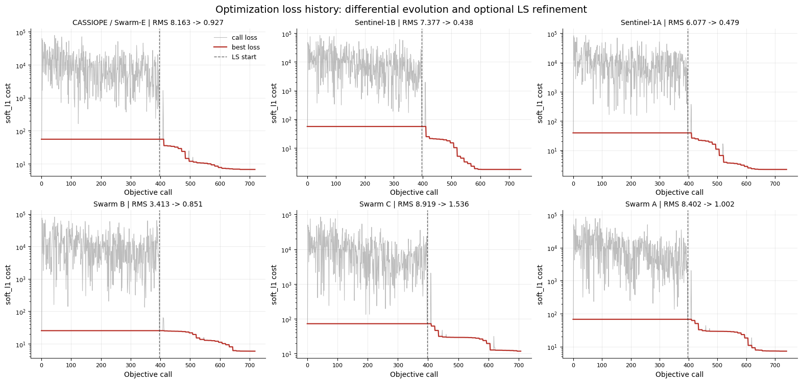

*Рисунок 16. История loss в варианте `differential_evolution` + optional LS refinement. Серая кривая показывает значения objective на вызовах функции, красная - лучшее найденное значение, вертикальная пунктирная линия отмечает переход к локальному `least_squares`, если он включен.*

### 5.4. Отключение оптимизации скоростей и N3

Проверялся вариант без оптимизации скоростей (`4_trajectory_tie_in_optimization_N2_no_velocity.ipynb`). Идея была упростить задачу и уменьшить число степеней свободы, но устойчивого улучшения это не дало. Для части спутников final error улучшался, для части ухудшался; поэтому оставлена полная оптимизация координат и скоростей.

Также проверялся вариант `N_MEASUREMENTS = 3`. Результаты оказались сопоставимыми с N2, но не дали однозначного выигрыша. Для основной линии анализа оставлен N2 как более дешевый и короткий tie-in сценарий, а N3 использовался как контроль.

### 5.5. MIPT-forces: EGM2008 + NRLMSISE-00

Наиболее сильное улучшение дала замена физической модели в ноутбуках:

- `4_trajectory_tie_in_optimization_N2_mipt_forces.ipynb`;
- `4_trajectory_tie_in_optimization_N3_mipt_forces.ipynb`.

Их конфигурация:

```text
N_MEASUREMENTS = 2 или 3
FORECAST_HOURS = 12
PROPAGATION_STEP_SECONDS = 120
earth_gravity_model = "egm2008"
gravity_max_degree = 8
gravity_max_order = 8
density_model = "nrlmsise00"
third_body_sun = True
third_body_moon = True
solar_radiation_pressure = True
srp_shadow_model = "none"
earth_radiation_model = "none"
relativity_model = "none"
tide_model = "none"
integrator = "dop853"
MAX_NFEV = 35
```

Для N2 MIPT-forces сохраненная сводка:

| Спутник | max `|dr|` baseline, km | max `|dr|` optimized, km | final `|dr|` baseline, km | final `|dr|` optimized, km |
| --- | ---: | ---: | ---: | ---: |
| CASSIOPE / Swarm-E | 2.888 | 2.198 | 2.354 | 1.072 |
| Sentinel-1B | 5.933 | 2.067 | 5.093 | 1.530 |
| Sentinel-1A | 5.795 | 1.431 | 4.511 | 1.126 |
| Swarm B | 2.316 | 1.463 | 2.143 | 0.673 |
| Swarm C | 5.465 | 1.052 | 5.465 | 0.402 |
| Swarm A | 5.432 | 1.488 | 5.432 | 0.498 |

Для N3 MIPT-forces:

| Спутник | max `|dr|` baseline, km | max `|dr|` optimized, km | final `|dr|` baseline, km | final `|dr|` optimized, km |
| --- | ---: | ---: | ---: | ---: |
| CASSIOPE / Swarm-E | 2.888 | 1.587 | 2.354 | 0.148 |
| Sentinel-1B | 5.933 | 3.149 | 5.093 | 2.830 |
| Sentinel-1A | 5.795 | 1.788 | 4.511 | 1.003 |
| Swarm B | 2.316 | 1.828 | 2.143 | 0.590 |
| Swarm C | 5.465 | 1.272 | 5.465 | 0.342 |
| Swarm A | 5.432 | 1.273 | 5.432 | 0.382 |

Главный вывод: с учетом EGM2008 и NRLMSISE-00 максимальная ошибка прогноза после оптимизации становится порядка `1-3 km` на горизонте 12 часов. Для N2 максимум optimized `|dr|` по 6 спутникам составил `2.198 km`; для N3 максимум dominated Sentinel-1B и составил `3.149 km`, при этом для большинства остальных спутников ошибка была около `1-2 km` или меньше.

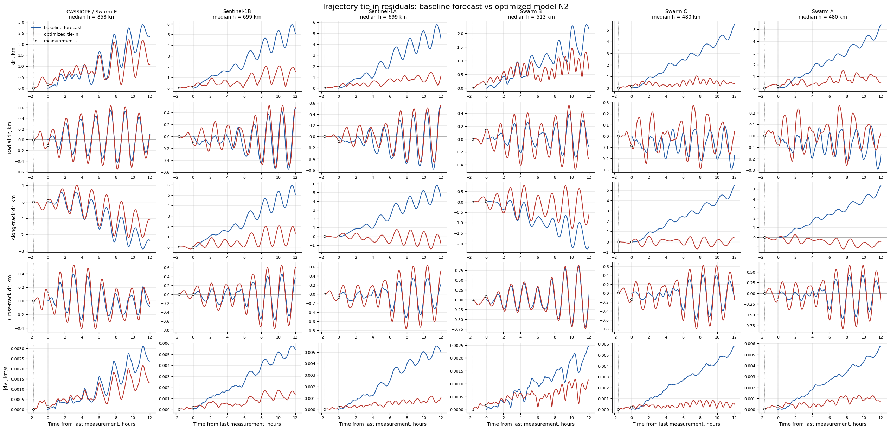

*Рисунок 17. Residual visualization для лучшего N2 MIPT-forces сценария: EGM2008 `(8,8)`, NRLMSISE-00, Sun/Moon, SRP, интегратор `dop853`. Синий цвет - baseline forecast от последнего измерения, красный - optimized tie-in, черные маркеры - tie-in measurements.*

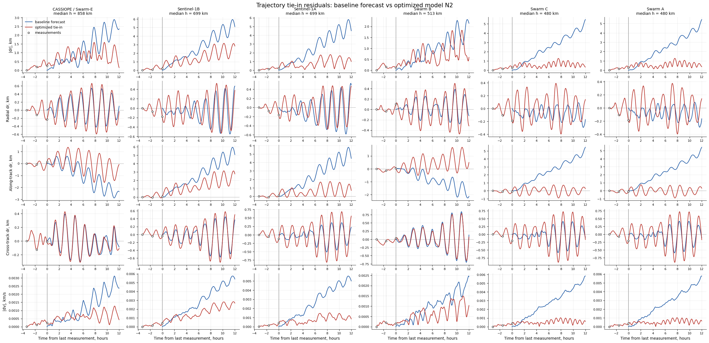

*Рисунок 18. Residual visualization для N3 MIPT-forces сценария с тремя измерениями в tie-in окне. Цвета совпадают с рисунком 12: синий - baseline, красный - optimized, черные маркеры - измерения.*

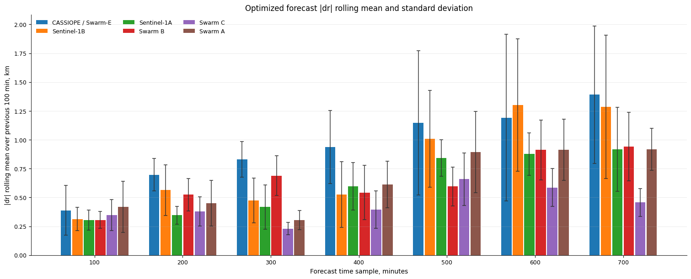

*Рисунок 19. Сжатая столбчатая сводка optimized N2 MIPT-forces результата. По оси `x` отложены 100-минутные окна прогноза, столбцы показывают средний `|dr|`, error bars - стандартное отклонение; цвет задает спутник.*

## 6. Исследование влияния NRLMSISE-00 и EGM2008

После того как продвинутая модель дала лучший результат, были сделаны отдельные эксперименты серии `5_...`, чтобы понять, что именно дает выигрыш.

### 6.1. Атмосфера: exponential vs NRLMSISE-00

В `5_atmosphere_model_importance_N2_mipt_forces.ipynb` сравнивались две модели после независимой LS-оптимизации:

- EGM2008 + экспоненциальная атмосфера;
- EGM2008 + NRLMSISE-00.

Сводка по `|dr|` показала, что NRLMSISE-00 дает явное улучшение для Sentinel-1B:

```text
Sentinel-1B:
  exponential: mean |dr|=2.715 km, final |dr|=4.912 km, max |dr|=5.461 km
  NRLMSISE-00: mean |dr|=0.811 km, final |dr|=1.530 km, max |dr|=2.067 km
```

Для остальных спутников различие было небольшим. Например, для Sentinel-1A mean `|dr|` был `0.606 km` у экспоненты и `0.615 km` у NRLMSISE-00; для CASSIOPE `0.954 km` и `0.945 km`. Поэтому вывод ограниченный: NRLMSISE-00 может быть критичен для отдельных объектов и условий, но в текущем наборе из 6 спутников основной выигрыш продвинутой модели не объясняется только атмосферой.

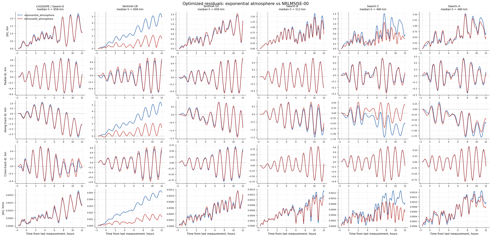

*Рисунок 20. Сравнение двух атмосферных моделей после независимой LS-оптимизации: экспоненциальная атмосфера и NRLMSISE-00. Цвета кривых соответствуют двум моделям в легенде; baseline не отрисован.*

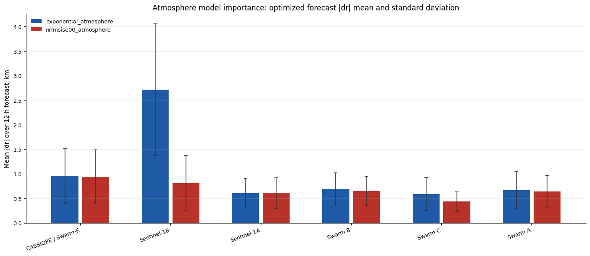

*Рисунок 21. Компактная сводка влияния атмосферы: для каждого спутника показаны два столбца - экспоненциальная атмосфера и NRLMSISE-00. Высота столбца - среднее `|dr|` на 12-часовом горизонте, error bars - стандартное отклонение.*

### 6.2. Гравитационное поле: J2 vs EGM2008 degree/order

В `5_egm2008_degree_importance_N2_mipt_forces.ipynb` сравнивались:

- аналитическая `J2` модель;
- EGM2008 `(2,2)`;
- EGM2008 `(4,4)`;
- EGM2008 `(8,8)`;
- EGM2008 `(12,12)`;
- EGM2008 `(24,24)`.

Все варианты проходили независимую LS-оптимизацию. Это важно: оптимизация начального состояния, баллистических коэффициентов и scale factors может частично компенсировать различия между моделями сил.

Результат: переход от `J2` к EGM2008 дает заметное улучшение. Но дальнейшее увеличение степени/порядка не дает монотонного и устойчивого выигрыша. Например, для CASSIOPE:

| Модель | mean `|dr|`, km | final `|dr|`, km | max `|dr|`, km |
| --- | ---: | ---: | ---: |
| J2 | 2.035 | 1.214 | 5.783 |
| EGM2008 `(2,2)` | 1.113 | 1.339 | 2.977 |
| EGM2008 `(8,8)` | 0.945 | 1.072 | 2.198 |
| EGM2008 `(24,24)` | 1.477 | 2.272 | 3.557 |

Для Sentinel-1B:

| Модель | mean `|dr|`, km | final `|dr|`, km | max `|dr|`, km |
| --- | ---: | ---: | ---: |
| J2 | 1.270 | 3.221 | 3.235 |
| EGM2008 `(2,2)` | 0.653 | 0.833 | 1.570 |
| EGM2008 `(8,8)` | 0.811 | 1.530 | 2.067 |

Вывод: на текущем горизонте 12 часов и при tie-in оптимизации важнее сам переход от простой осесимметричной J2-модели к body-fixed гармоническому полю с долготными членами степени 2. Высокие степени `(8,8)`, `(12,12)`, `(24,24)` в этой постановке не дали надежного дополнительного выигрыша. Это не доказывает, что высокие гармоники физически не важны; скорее, их вклад на данном горизонте может компенсироваться оптимизацией начального состояния и параметров.

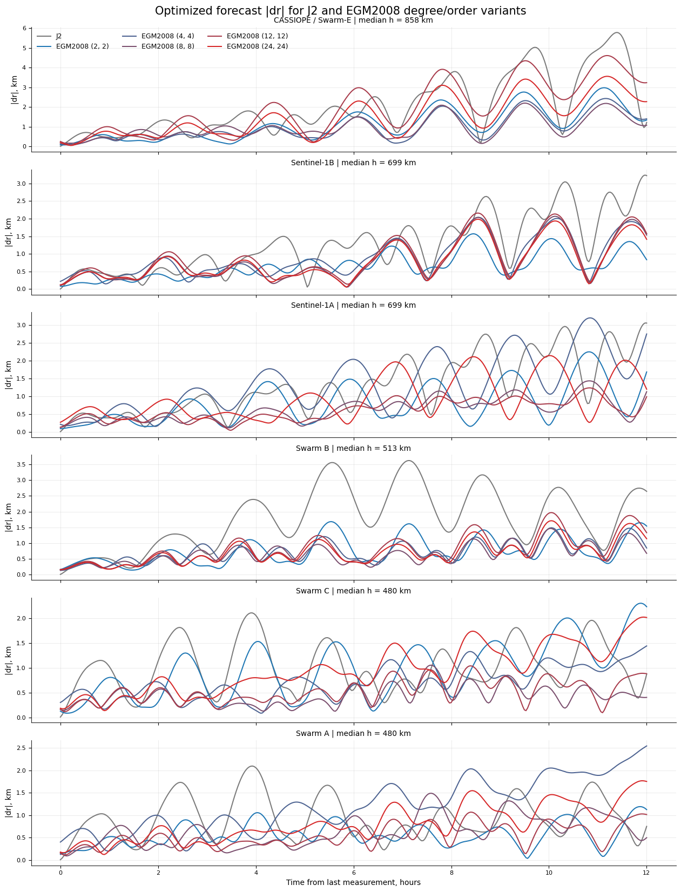

*Рисунок 22. Сравнение моделей гравитационного поля после независимой LS-оптимизации. Серый цвет соответствует J2, остальные цвета - вариантам EGM2008 с разными `(degree, order)`; на каждой оси показан `|dr|` для одного спутника.*

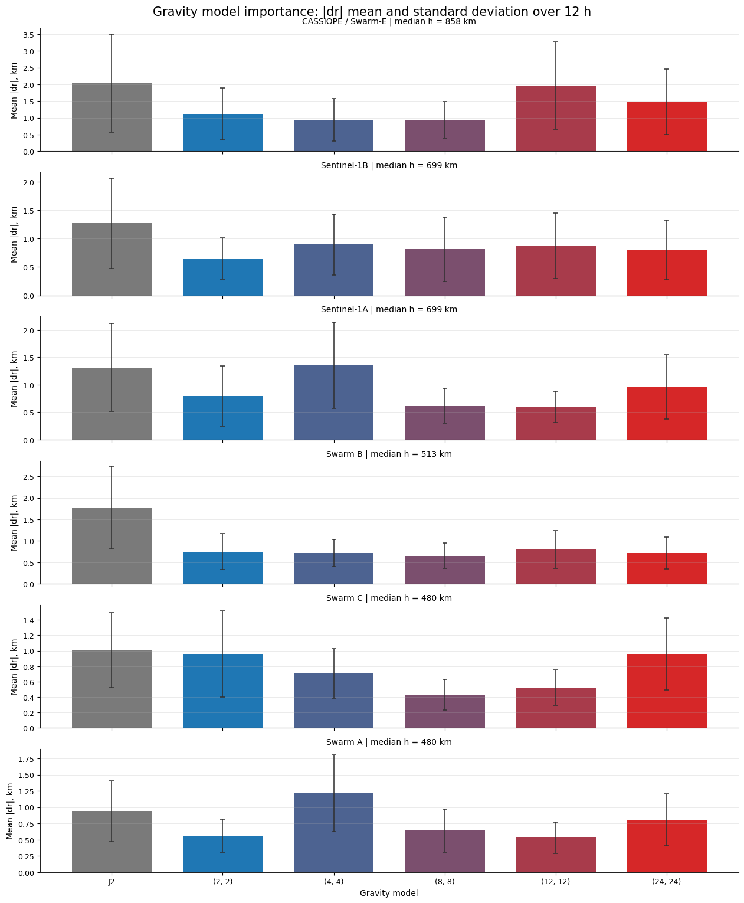

*Рисунок 23. Компактная сводка влияния гравитационного поля. Серый столбец - J2, цветовая градация от синего к красному - EGM2008 от грубого `(2,2)` к более детальному `(24,24)`. Высота столбца - mean `|dr|`, error bars - std `|dr|`.*

## 7. Итоговый результат

Наилучший практический результат в рамках проведенного исследования дали ноутбуки:

- `4_trajectory_tie_in_optimization_N2_mipt_forces.ipynb`;
- `4_trajectory_tie_in_optimization_N3_mipt_forces.ipynb`.

Итоговая рекомендуемая постановка для дальнейшего развития:

```text
Данные:
  2-3 последних измерения state vector [r, v]
  координаты: m
  скорости: m/s

Оптимизация:
  scipy.optimize.least_squares
  loss = "soft_l1"
  N_MEASUREMENTS = 2 как базовый дешевый режим
  N_MEASUREMENTS = 3 как контрольный режим
  оптимизировать координаты, скорости, Cd*A/m, Cr*A/m
  anchor последнего измерения: LAST_MEASUREMENT_OBSERVATION_SCALE = 0.2

Динамика:
  integrator = "dop853"
  earth_gravity_model = "egm2008"
  gravity_max_degree = 8
  gravity_max_order = 8
  density_model = "nrlmsise00"
  third_body_sun = True
  third_body_moon = True
  solar_radiation_pressure = True
  srp_shadow_model = "none"
  earth_radiation_model = "none"
  relativity_model = "none"
  tide_model = "none"
```

Практический результат: для 6 спутников НОО на горизонте 12 часов optimized `|dr|` в N2 MIPT-forces сценарии оказался не хуже `2.198 km` по максимуму среди всех спутников. Это существенно лучше раннего уровня порядка `~6 km` и достаточно мало по сравнению с грубой оценкой средней трехмерной характерной длины между отслеживаемыми объектами мусора в НОО.

Сравнение с оценкой из раздела 1.1 показывает запас по порядку величины. Даже для самой плотной из приведенных грубых оценок - популяции `1 mm-1 cm` в оболочке `500-900 km` - характерная длина составляет `L ~ 12 km`. Ошибка прогноза около `2 km` примерно в 6 раз меньше этой величины. Для объектов `1-10 cm` и `>10 cm` характерные длины еще больше (`~59 km` и `~167 km` в той же оболочке), поэтому достигнутая точность достаточна для сужения области поиска и последующей идентификации объекта по повторному радиолокационному наблюдению. Это не отменяет необходимости учитывать орбитальную плоскость, относительную скорость и неопределенность измерений, но по пространственному масштабу результат находится ниже минимальной оценки `L`.

Основные ограничения результата:

- reference данные относятся к 6 действующим аппаратам, а не к реальным фрагментам мусора с плохо известными баллистическими параметрами;
- ориентация аппарата и панельная геометрия не моделируются;
- EGM2008 ускорение считается численным градиентом, что проще для проверки, но медленнее аналитических производных;
- NRLMSISE-00 зависит от качества space weather inputs;
- оптимизация scale factors сил полезна как engineering-подгонка, но может маскировать физические различия моделей;
- оценка плотности мусора является приближенной и не заменяет специализированные модели ORDEM/MASTER.

## 8. Воспроизводимость

Исходные reference данные хранятся в `data/` и в ходе подготовки отчета не изменялись. Тяжелые оптимизационные ноутбуки не перезапускались: использованы сохраненные outputs. Изображения для отчета сохранены в `reports/assets/`. Для Plotly-графиков из `1_orbit_propagation_demo.ipynb` созданы статические Matplotlib-версии по уже сохраненным данным графиков.

Проверяемые артефакты:

- `reports/final_research_report.md` - этот отчет;
- `reports/assets/fig_01_orbit_3d_static.png`;
- `reports/assets/fig_01_ground_track_static.png`;
- `reports/assets/fig_02_*.png`;
- `reports/assets/fig_03_*.png`;
- `reports/assets/fig_04_*.png`;
- `reports/assets/fig_05_*.png`.

Для перевода в LaTeX/PDF следующий шаг - заменить относительные ссылки на изображения командами `\includegraphics`, перенести таблицы в `tabular` и оформить источники как `bib` или ручной список литературы.
